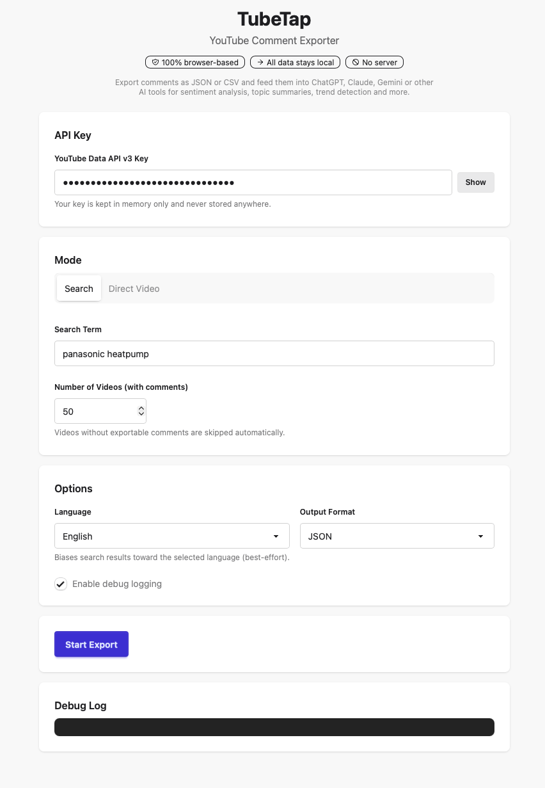

# TubeTap - YouTube Comment Exporter/Downloader in HTML/JS

A fully browser-based HTML/JS tool for exporting YouTube comments. No backend, no tracking, no data storage. All data stays local in your browser. Runs entirely as a static web page.



## What it does

- **Search mode**: Search YouTube for videos by keyword and export comments from multiple videos at once.
- **Direct video mode**: Paste a YouTube video URL or ID and export all its comments.
- Export as **JSON** (structured, ideal for further processing) or **CSV** (one row per comment).
- Download results directly to your computer.

## Privacy & Security

- **No backend** — all API calls go directly from your browser to the YouTube Data API.
- **No tracking or analytics** — zero third-party scripts.
- **API key is never stored** — it is held only in JavaScript runtime memory. It is not saved to localStorage, sessionStorage, cookies, IndexedDB, or the URL. Closing or reloading the tab erases it completely.
- **No data leaves your browser** except direct requests to the YouTube Data API using your own key.

## Getting started

### 1. Get a YouTube Data API v3 key

1. Go to the [Google Cloud Console](https://console.cloud.google.com/).
2. Create a project (or select an existing one).
3. Navigate to **APIs & Services > Library**.
4. Search for **YouTube Data API v3** and enable it.
5. Go to **APIs & Services > Credentials**.
6. Click **Create Credentials > API key**.
7. **Restrict your key**:
   - Under **API restrictions**, select **Restrict key** and choose **YouTube Data API v3** only.
   - Under **Application restrictions**, select **HTTP referrers** and add the domain(s) where you will host this app (e.g., `https://yourusername.github.io/*`). For local development, add `http://localhost:*`.
8. Copy the key. You will paste it into the app each session.

### 2. Run locally

No build step is needed. Just open `index.html` in a browser, or serve the files with any static file server:

```bash
# Python
python3 -m http.server 8000

# Node.js (npx)
npx serve .

# PHP
php -S localhost:8000
```

Then open `http://localhost:8000` in your browser.

### 3. Deploy on GitHub Pages

1. Push this repository to GitHub.
2. Go to **Settings > Pages**.
3. Under **Source**, select the branch (e.g., `main`) and folder (`/ (root)`).
4. Save. Your site will be available at `https://<username>.github.io/<repo>/`.
5. Remember to add your GitHub Pages URL to your API key's HTTP referrer restrictions.

## How it works

### Search mode

1. Enter your API key, a search term, the desired number of videos, language preference, and output format.
2. The app searches YouTube for matching videos using the YouTube Data API v3 `search.list` endpoint.
3. For each candidate video, it checks whether comments are publicly available.
4. Videos without exportable comments (e.g., comments disabled) are automatically **skipped** and do not count toward your requested total.
5. The app continues searching through additional result pages until the requested number of qualifying videos is reached, or no more results are available.
6. For each qualifying video, **all** publicly available comments and replies are fetched via pagination.
7. If fewer qualifying videos are available than requested, the app exports everything it found and reports the shortfall.

**Important**: The "number of videos" setting refers to videos that actually have exportable comments. If you request 20 videos, the app will keep searching until it finds 20 with comments, skipping any that don't qualify.

### Direct video mode

1. Enter your API key and a YouTube video URL or video ID.
2. The app extracts the video ID from the input (supports standard URLs, short URLs, embed URLs, and Shorts URLs).
3. All publicly available comments and replies for that specific video are fetched.
4. If comments are disabled or unavailable, a clear error message is shown.

### Language selection

The language selector uses the YouTube API's `relevanceLanguage` parameter to bias search results toward the selected language. This is a **best-effort** filter provided by the YouTube API — it influences ranking but does not guarantee that all returned videos will be in the selected language. YouTube does not offer a strict language-only filter for search results.

Language selection does not affect Direct video mode (a specific video is fetched regardless of language).

### Comments

The app exports only comments that are publicly available through the YouTube Data API v3. This includes:

- Top-level comments
- Replies to comments (fetched with full pagination)

Comments that are held for review, spam-filtered, or otherwise hidden by YouTube will not appear in the export.

## Output formats

### JSON

A structured JSON file with full metadata, suitable for processing with ChatGPT, scripts, or data analysis tools:

```json
{
  "mode": "search",
  "search_term": "machine learning",
  "language": "en",
  "requested_video_count": 5,
  "actual_video_count": 5,
  "exported_at": "2025-01-15T10:30:00.000Z",
  "export_format": "json",
  "videos": [
    {
      "video_id": "abc123",
      "title": "Video Title",
      "channel_title": "Channel Name",
      "description": "...",
      "published_at": "...",
      "url": "https://www.youtube.com/watch?v=abc123",
      "search_rank": 1,
      "comment_count_exported": 42,
      "comments": [
        {
          "comment_id": "...",
          "parent_id": null,
          "author": "User Name",
          "text_display": "Great video!",
          "text_original": "Great video!",
          "like_count": 5,
          "published_at": "...",
          "updated_at": "...",
          "is_reply": false
        }
      ]
    }
  ]
}
```

### CSV

A flat CSV file with one row per comment, suitable for spreadsheets or tabular analysis. Columns:

| Column | Description |
|--------|-------------|
| mode | "search" or "direct_video" |
| search_term | The search query used (empty in direct mode) |
| language | Selected language code |
| video_id | YouTube video ID |
| video_title | Title of the video |
| channel_title | Channel that uploaded the video |
| search_rank | Rank in search results (empty in direct mode) |
| comment_id | Unique comment ID |
| parent_id | Parent comment ID (empty for top-level comments) |
| author | Comment author display name |
| text_display | Comment text (rendered) |
| text_original | Comment text (original) |
| like_count | Number of likes on the comment |
| published_at | When the comment was posted |
| updated_at | When the comment was last updated |
| is_reply | Whether this is a reply to another comment |

CSV files include a UTF-8 BOM for proper Excel compatibility.

## Debug mode

Enable the debug checkbox to see detailed log entries in the UI, including:

- Search progress and pagination
- Which videos are being checked
- Which videos were skipped and why
- Comment fetching progress per video
- Error details

Debug messages are also mirrored to the browser console.

## Error handling

The app handles these cases gracefully:

- **Missing API key** — prompts the user before starting
- **Invalid video URL/ID** — shows a clear validation error
- **Comments disabled** — skips the video in search mode; shows an error in direct mode
- **API quota exceeded** — shows a specific quota error message
- **Network errors** — caught and reported per video
- **Partial failures** — one failed video does not abort the entire export; the app skips it and continues

## Technical details

- **Vanilla JavaScript** — no frameworks, no build step, no dependencies
- **Static files only** — `index.html`, `app.js`, `styles.css`
- **Compatible with any static host** — GitHub Pages, Netlify, Vercel, S3, or a local file server
- **Responsive design** — works on desktop and mobile browsers

## API quota usage

YouTube Data API v3 has a daily quota (typically 10,000 units for new projects). Approximate costs per call:

| Operation | Quota cost |
|-----------|-----------|
| `search.list` | 100 units |
| `videos.list` | 1 unit |
| `commentThreads.list` | 1 unit |
| `comments.list` (replies) | 1 unit |

Search mode uses significantly more quota than direct video mode. For large exports, monitor your quota in the [Google Cloud Console](https://console.cloud.google.com/apis/dashboard).

## License

MIT
